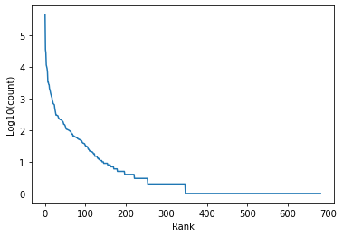

# Data

The files used for the SIGMORPHON/CONLL Shared Task 2019 are in CONLL-U format, except with the `features` column automatically converted<sup>[3](#udconversion)</sup> to UniMorph tagsets<sup>[2](#unimorphschema)</sup>. Data files can be found [here](https://github.com/sigmorphon/2019).

Since the competition, the UD treebanks have seen 6 new releases, with improvements and extensions made to many of the used corpora. To use these datasets instead, we have similary converted UD2.9 to carry UniMorph tags using the [ud-compatibility](https://github.com/unimorph/ud-compatibility) repo. Datasets with existing train/valid/test splits can be found in the [Google Drive](https://drive.google.com/file/d/1lSYGYB-4b5dztlg1iilccctI1KAxVV_e/view?usp=sharing).

This section explains several other details regarding dataset creation and usage. Remaining files are primarily for useful meta-data.

<details>
<summary><b>Languages</b></summary>
<p style="margin-left: 40px">

While there are now many [UD treebanks](https://universaldependencies.org/#language-), not all lend themselves equally well to this task. Using the informaton scraped from the UD site, if limiting to languages with quality above 0 (treebanks with important information missing or misformatted are punished to have quality very near 0), and support from common pre-trained models like FastText and BERT, 38 languages over 15 linguistic typologies remain. Of these, most, but not all, are high-resource (and likely provide strong models).

The remaining languages are detailed in the table below.

|            | Family                        |   N_Treebanks |   Sentences (k) |   Tokens (k) |   N_Genres |   Stars |
|------------|-------------------------------|:-------------:|:---------------:|:------------:|:----------:|:-------:|
| Afrikaans  | IE, Germanic                  |             1 |               2 |           49 |          2 |     3.5 |
| Arabic     | Afro-Asiatic, Semitic         |             1 |               8 |          242 |          1 |     3   |
| Armenian   | IE, Armenian                  |             1 |               3 |           52 |          6 |     4   |
| Belarusian | IE, Slavic                    |             1 |              25 |          305 |          7 |     4.5 |
| Bulgarian  | IE, Slavic                    |             1 |              11 |          156 |          3 |     4   |
| Catalan    | IE, Romance                   |             1 |              17 |          537 |          1 |     4   |
| Croatian   | IE, Slavic                    |             1 |               9 |          199 |          3 |     4   |
| Czech      | IE, Slavic                    |             4 |             127 |         2204 |          5 |     4   |
| Dutch      | IE, Germanic                  |             2 |              21 |          307 |          1 |     2.5 |
| English    | IE, Germanic                  |             6 |              38 |          608 |          2 |     3   |
| Estonian   | Uralic, Finnic                |             2 |              37 |          511 |          4 |     4   |
| Finnish    | Uralic, Finnic                |             1 |              15 |          202 |          6 |     3.5 |
| French     | IE, Romance                   |             5 |              25 |          559 |          4 |     3.5 |
| Galician   | IE, Romance                   |             1 |               1 |           23 |          1 |     3.5 |
| German     | IE, Germanic                  |             2 |             206 |         3687 |          3 |     4   |
| Greek      | IE, Greek                     |             1 |               3 |           62 |          3 |     3.5 |
| Icelandic  | IE, Germanic                  |             2 |              51 |         1142 |          4 |     3   |
| Indonesian | Austronesian, Malayo-Sumbawan |             2 |               7 |          148 |          2 |     3.5 |
| Irish      | IE, Celtic                    |             1 |               5 |          116 |          5 |     2   |
| Italian    | IE, Romance                   |             5 |              34 |          737 |          3 |     3.5 |
| Japanese   | Japanese                      |             2 |              16 |          344 |          2 |     2   |
| Latin      | IE, Latin                     |             1 |               9 |          242 |          2 |     4   |
| Latvian    | IE, Baltic                    |             1 |              16 |          266 |          5 |     3.5 |
| Lithuanian | IE, Baltic                    |             2 |               4 |           75 |          4 |     2.5 |
| Norwegian  | IE, Germanic                  |             2 |              38 |          612 |          3 |     4   |
| Polish     | IE, Slavic                    |             2 |              39 |          478 |          5 |     4   |
| Portuguese | IE, Romance                   |             1 |               9 |          211 |          1 |     4   |
| Romanian   | IE, Romance                   |             3 |              40 |          937 |          2 |     4   |
| Russian    | IE, Slavic                    |             3 |             110 |         1813 |          1 |     4   |
| Serbian    | IE, Slavic                    |             1 |               4 |           98 |          1 |     4   |
| Slovak     | IE, Slavic                    |             1 |              11 |          106 |          3 |     3.5 |
| Slovenian  | IE, Slavic                    |             2 |              11 |          170 |          3 |     3.5 |
| Spanish    | IE, Romance                   |             1 |              18 |          555 |          1 |     4   |
| Swedish    | IE, Germanic                  |             1 |               5 |           91 |          3 |     3.5 |
| Tamil      | Dravidian, Southern           |             1 |               1 |            9 |          1 |     2.5 |
| Telugu     | Dravidian, South Central      |             1 |               1 |            6 |          1 |     1   |
| Turkish    | Turkic, Southwestern          |             6 |              73 |          640 |          2 |     3.5 |
| Welsh      | IE, Celtic                    |             1 |               2 |           41 |          5 |     2.5 |

</p>
</details>

<details>
<summary><b>Lemmatization as Classification</b></summary>
<p>

Lemmatization is the task of taking a word-form (potentially inflected or derivated), and convert it to its dictionary entry form. In terms of ML, this is a seq2seq task at the character level. Despite this, the best competition entries model inflection as a token-level classification task, where the classes are deterministic mappings based on minimal edit scripts. While this constricts the model to only edit actions present in the training dataset, it is empirically found to allow for faster convergence and strong performance regardless.

Briefly, a lemma script consists of three parts, i) the capitalization script, denoting which case is used from which character onwards, ii) the prefix edit script and the affix edit script. The prefix and affix are determined to be those parts of the string before and after, respectively, of the longest common substring with word form. Three actions are possible: '-' remove the character, '+?' add a character, '*' keep the character. Two special cases exist: 'ign_?' ignore the word form altogether and use an irregular lemma, 'd' do nothing. In the scripts, the separate parts are divided by a pipe character.

In `./data/lemma_script.py` the class `LemmaScriptGenerator` implements a Myer's diff algorithm variant (adapted from [myersdiff](https://github.com/amar-b/myersdiff)) to generate the lemma script. The function `apply_lemma_script` applies a lemma script to a word-form, producing a lemma. In the case that the edit script is misconfigures and is too long for the word-form, the script returns an intermediate result.

The 15 most common lemma edit scripts for the English language are
| Rule         |   Count | Examples                                        |
|--------------|---------|-------------------------------------------------|
| L0\|d\|d     |  450024 | the→the, i→i, like→like                         |
| L0\|d\|-     |   35460 | arrives→arrive, later→late, flights→flight      |
| U0,L1\|d\|d  |   27682 | Tuesday→Tuesday, President→President, Bush→Bush |
| L0\|ign_be   |   11628 | 'm→be, is→be, am→be                             |
| L0\|d\|--    |   10252 | sixth→six, over→ov, does→do                     |
| U0\|d\|d     |    8944 | I→I, i→I, AP→AP                                 |
| L0\|d\|---   |    6917 | cheapest→cheap, returning→return, laying→lay    |
| L0\|--+b\|d  |    3321 | 're→be, Are→be, are→be                          |
| L0\|d\|---+e |    3295 | leaving→leave, making→make, arriving→arrive     |
| L0\|d\|-+v+e |    2841 | HAS→have, has→have, had→have                    |
| U0\|ign_I    |    2745 | my→I, me→I, Me→I                                |
| L0\|d\|---+y |    2039 | carries→carry, cities→city, earlier→early       |
| L0\|d\|--+e  |    1932 | him→he, ninth→nine, his→he                      |
| L0\|d\|-+o*  |    1646 | grew→grow, knew→know, 'nt→not                   |
| L0\|d\|--+y  |    1433 | their→they, said→say, paid→pay                  |

In general, the lemma scripts are strongly exponential, with most unique instances corresponding to extremely rare instances.

<p align="center">
    
</p>

</p>
</details>

<details>
<summary><b>Corpus</b></summary>
<p>

The class `DocumentCorpus` in `./data/corpus` provides all utilities for loading in and processing a collection of conll-u structured files into a single PyTorch dataset. Class-method `.parse_connlu_file` allows for reading in a single CONLL-u file, keeping only the relevant fields (using [conllu](https://github.com/EmilStenstrom/conllu/)). Once loading-in has completed, class-method `.setup` generates the necesarry vocabularies and torch tensors. Class-method `.def collate_batch` is ideal for taking a list of documents from the corpus and transforming these to trainable tensors (including characters, tokens, pretrained embeddings, etc.).

Before creating a corpus, however, choosing which files to include is important. The function `get_conllu_files` iterates through the `source` directory, searching for files that match the treebank-name, language provided.

The `TreebankDataModule` class is a PyTorch-Lightning `DataModule` that wraps both of the above, and streamlines the entire process (ideal for training scripts). To build, first call the `.prepare_data` class-method, which searches for files with the right language-family and name pairing (e.g. "Germanic" & "PUDT" or "English" & "merge"). After, the `.setup` class-method prepares for training. Train, validation and test dataloaders are also provided.

To build a `TreebankDataModule` for later use (takes about 10-15 minutes for larger languages like Czech or Russian), run

```python
python -u build_treebank_corpus.py hydra/job_logging=disabled hydra/hydra_logging=disabled
```

The corresponding config file, completely overwritable using Hydra's comman-line interface, can be found in `./config/treebank_corpus.yaml`.

</p>
</details>

<details>
<summary><b>Dataloaders</b></summary>
<p>

Ultimately, morphological analysis and lemmatization in context is a token-level seq2seq task. Batching at the sentence level, even when length-sorting, will be inefficient, with only the first batches containing long sentences, and the last containg a few words at most. To ensure constant memory usage, and reduce the number of batches per epoch `./data/dataloaders.py` contains classes that batch according to the total number of tokens, dynamically allocating the batch-size.

</p>
</details>

# Pipeline Creation

If you have access to a trained model checkpoint and a `TreebankDataModule`, a pipeline can be constructed. This converts the model to PyTorch only code. If the text is not yet tokenized, a tokenizer must be provided (and input is expected to be `List[str]` as opposed to `List[List[str]]`). I recommend the [MosesTokenizer](https://github.com/alvations/sacremoses), as it aligns closely to the manual tokenization within the CONLL files.

```python
from morphological_tagging.pipelines import UDPipeline

tokenizer = MyTokenizer()

pipeline = UDPipe2Pipeline(tokenizer)

pipeline.load_vocabs_from_treebankdatamodule_checkpoint(dataset_checkpoint.pickle)
pipeline.load_tagger(model_checkpoint.ckpt, map_location=device)
pipeline = pipeline.to(device)
```

```python
pipeline.save(save_loc)
```

</p>
</details>

# Models
## UDPipe2

<p align="center">
    
</p>

Designed and implemented by M. Straka and colleagues at UFAL Prague, the second version of the UDPipe pipeline has shown excellent performance in several competitions. It consists of an entirely modular system, processing various forms of pre-trained and trainable word embeddings via a residual RNN, before classifying a tokens' morphological tag set and lemma edit script.

Ultimately, this UDPipe2 was 1 of 3 winners at CONLL 2018's shared task, and 1 of 2 at CONLL/SIGMORPHON 2019 shared task 2, and the winner at the EvaLatin 2020 shared task.

Relative to other models in this repository, the backward step is small. This results in relatively fast training, even for the largest datasets. Due to the emphasis on combining pre-trained word/context-embeddings, performance is strong almost out-of-the-box.

For more information, see the [dedicated website](https://ufal.mff.cuni.cz/udpipe/2), the [Github repository](https://github.com/ufal/udpipe/tree/udpipe-2), or any of the published system papers <sup>[4](#udpipe2conll)</sup> <sup>[5](#UDPipe2SIGMORPHON)</sup> <sup>[6](#UDPipe2EvaLatin)</sup>.

<details>
<summary><b>Test Set Performance</b></summary>
<p>

| | Lemma Acc.       | Lev. Dist.       | Morph. Set Acc.   | Morph. Tag F1  (micro/macro)   |   Tokens/sec |
|:---|:---:|:---:|:---:|:---:|:---:|
| Arabic  | 0.93 +- 1.54e-03 | 0.21 +- 5.32e-03 | 0.90 +- 1.81e-03  | 0.96/0.85       |         2313.08 |
| Czech   | 0.98 +- 2.78e-04 | 0.03 +- 6.10e-04 | 0.92 +- 5.82e-04  | 0.98/0.90       |         2930.3  |
| Dutch   | 0.94 +- 1.60e-03 | 0.12 +- 3.83e-03 | 0.95 +- 1.51e-03  | 0.97/0.93       |         3222.71 |
| English | 0.97 +- 6.07e-04 | 0.05 +- 1.33e-03 | 0.92 +- 1.01e-03  | 0.96/0.90       |         2976.7  |
| Finnish | 0.82 +- 2.64e-03 | 0.44 +- 7.71e-03 | 0.81 +- 2.69e-03  | 0.92/0.62       |         2632.62 |
| French  | 0.98 +- 6.72e-04 | 0.04 +- 1.63e-03 | 0.92 +- 1.25e-03  | 0.97/0.87       |         3715.83 |
| Russian | 0.97 +- 4.05e-04 | 0.06 +- 9.90e-04 | 0.92 +- 6.40e-04  | 0.97/0.88       |         2759.4  |
| Turkish | 0.91 +- 1.21e-03 | 0.19 +- 3.13e-03 | 0.77 +- 1.80e-03  | 0.89/0.58       |         1828.43 |

*Tokens per second* measured using a NVIDIA GTX 1080Ti GPU, with batches of 2048 tokens.

</p>
</details>

<details>
<summary><b>Differences</b></summary>
<p>

1. **Morph. tag factoring**: due to some morphological tags not being present in the initial UniMorph schema, and lack of detail regarding implementation, regularisation was not conducted via factoring the tags into their classes. Rather, the model was further tasked with seperately predicting presence of a cateogry
2. **Sparse embeddings**: PyTorch's sparse word embeddings and LazyAdam resulted in some very nasty optimization errors. Instead, non-sparse variants are used. This proved equally fast, and likely provided some additional reguralization
3. **Additional Reguralization**: overfit seems the most prevalent issue. As such, some additional regularization methods were applied. Both tokens and characters are masked (with low likelihood) prior to being fed into their respective models. Where possible, weight-decay was applied via AdamW

</p>
</details>

#### Training

To train UDPipe2 from scratch, run:

```bash
python -u train_tagger.py --config-name udpipe2_experiment hydra/job_logging=disabled hydra/hydra_logging=disabled
```

Models are saved to the checkpoints directory.

Hydra's override syntax can be used to alter practically any aspect of training.

<details>
<summary><b>Arguments</b></summary>
<p>The [default config file](./config/udpipe2_experiment) post-processing looks like:

```yaml
# From ./config/default_train.yaml
# Experiment setup default for all models
print_hparams: False
prog_bar_refresh_rate: 200

monitor: valid/clf_agg
monitor_mode: "max"
save_checkpoints: True
save_top_k: 1

seed: 610
gpu: 1
deterministic: False
debug: False
fdev_run: False

logging:
  logger: wandb
  logger_kwargs:
    project: morphological_tagging_v2
    log_model: True
    offline: False

# From ./config/udpipe2_experiment.yaml
# Experiment setup specific to UDPipe2
experiment_name: UDPipe2
architecture: udpipe2

data:
  language: English
  treebank_name: ATIS
  batch_first: False
  len_sorted: True
  batch_size: 32
  source: ./morphological_tagging/data/um-treebanks-v2.9

trainer:
  gradient_clip_val: 2
  max_epochs: 60
  num_sanity_val_steps: 0

# From ./config/preprocessor/udpipe2.yaml
# These get fed to the UDPipe2 model, then to the UDPipe2Preprocessor class
preprocessor:
    word_embeddings: True
    context_embeddings: True
    tokenizer: None
    language: English
    lower_case_backup: False
    transformer_name: bert-base-multilingual-cased
    transformer_dropout: null
    layer_pooling: average
    n_layers_pooling: 4
    wordpiece_pooling: first

# From ./config/model/udpipe2.yaml
# These get fed to the UDPipe2 model
model:
    c2w_kwargs:
        embedding_dim: 256
        h_dim: 256
        out_dim: 256
        bidirectional: True
        rnn_type: gru
        batch_first: False
        dropout: 0.5
    w_embedding_dim: 512
    word_rnn_kwargs:
        h_dim: 512
        bidirectional: True
        rnn_type: lstm
        num_layers: 3
        residual: True
        batch_first: False
        dropout: 0.5
    char_mask_p: 0.1
    token_mask_p: 0.2
    label_smoothing: 0.03
    reg_loss_weight: 2
    lr: 1.0e-3
    betas:
    - 0.9
    - 0.99
    weight_decay: 1.0e-2
    scheduler_name: step
    scheduler_kwargs:
        milestones:
            - 40
        gamma: 0.1

# From ./config/default_train.yaml
# Prevents Hydra altering the working directory
hydra:
  run:
    dir: .
  output_subdir: null
  sweep:
    dir: .
    subdir: .


```

If a `TreebankDataModule` has been generated and saved already, it can be loaded in by using the override

```bash

++data.file_path=./morphological_tagging/data/corpora/{$FILE_NAME}.pickle

```

This will invalidate all other `data` keys, besides `batch_size`.

Make certain to alter the preprocessor's language as well:

```bash

++logging.logger_kwargs.job_type={$LANGUAGE} ++preprocessor.language={$LANGUAGE} ++data.language={$LANGUAGE}

```

The `trainer` key specifies keyword arguments for a PyTorch-Lightning trainer. For example, to easily specify half-precision training, simply use override

```bash
++trainer.precision=16
```

</p>
</details>

## DogTag
**TODO**: add details on DogTag